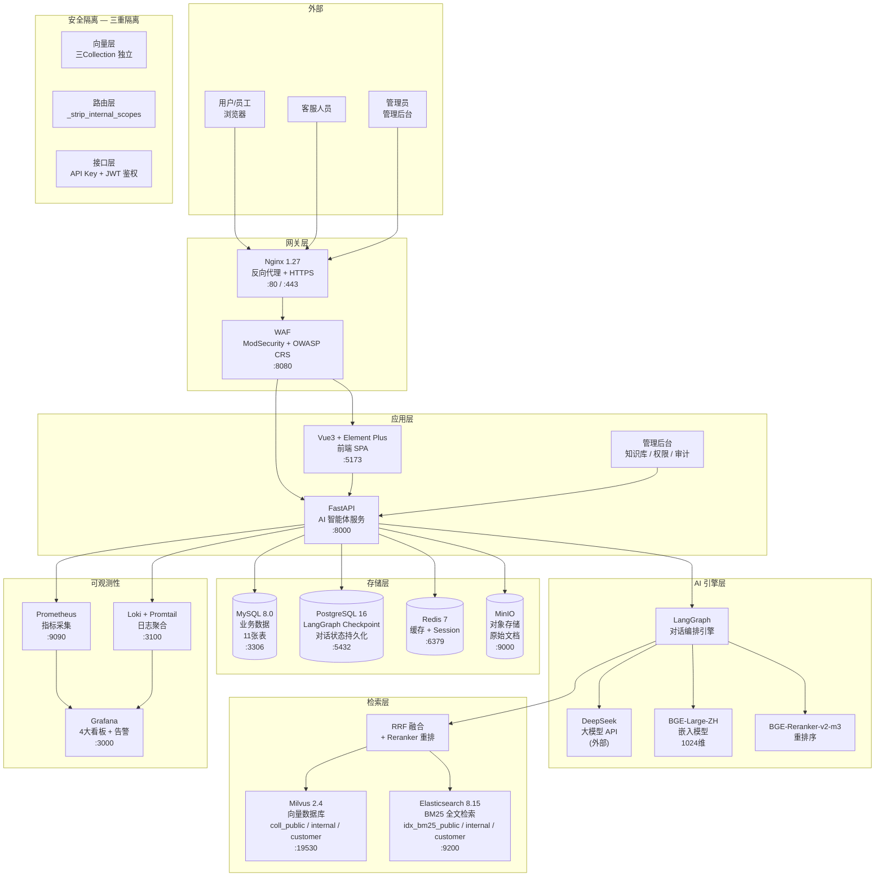

# 系统架构图



## 核心数据流

```
用户提问
  → Nginx (HTTPS + WAF)
  → FastAPI (/api/agent/*/chat)
  → LangGraph Workflow:
      1. 输入校验 (SQL注入/禁答词/Prompt注入)
      2. 鉴权 (JWT → scope > permission)
      3. 查询改写 (同义词+指代消解)
      4. 路由分发 (FAQ or RAG)
      5a. FAQ 匹配 (余弦相似度 ≥0.92 短路)
      5b. 混合检索 (BM25{Dense→RRF k=60→Reranker topK=First)
      6. 工具调用 (ReAct 循环, max 3 iterations)
      7. 上下文组装 (Token 预算截断)
      8. 答案生成 (DeepSeek + Prompt 模板)
      9. 输出校验 (敏感词脱敏+置信度)
      10. 日志记录 (ChatLog/OperateLog/SecurityLog)
  → SSE 流式输出
  → ChatLog 异步落库 (MySQL)
  → Checkpoint 状态保存 (PostgreSQL)
```

## 双智能体对比

| 特性 | 内部智能体 | 客服智能体 |
|------|-----------|-----------|
| 入口 | `/api/agent/internal/chat` | `/api/agent/customer/chat` |
| Scope | public + internal | public + customer |
| FAQ 匹配 | all_scopes | customer + public (硬编码) |
| 转人工 | 不支持 | 4 类触发条件 |
| 工具调用 | search_kb + decompose | 不支持 |
| 速率限制 | 30/min | 60/min |

## 部署架构

```
docker compose up -d (15 个服务)

kb-waf        :8080 → ModSecurity WAF 代理
kb-nginx      :80/443 → 反向代理
kb-backend    :8000 → FastAPI (uvicorn, hot-reload)
kb-frontend   :5173 → Vue3 + React 管理后台 (合并构建)
kb-mysql      :3306 → 业务库
kb-postgres   :5432 → Checkpoint 库
kb-redis      :6379 → 缓存
kb-es         :9200 → BM25 检索
kb-milvus     :19530 → 向量检索
kb-etcd       :2379 → Milvus 元数据
kb-minio      :9000 → 对象存储
kb-prometheus :9090 → 指标采集
kb-grafana    :3000 → 监控看板
kb-loki       :3100 → 日志聚合
kb-promtail   (无端口) → 日志采集
```
